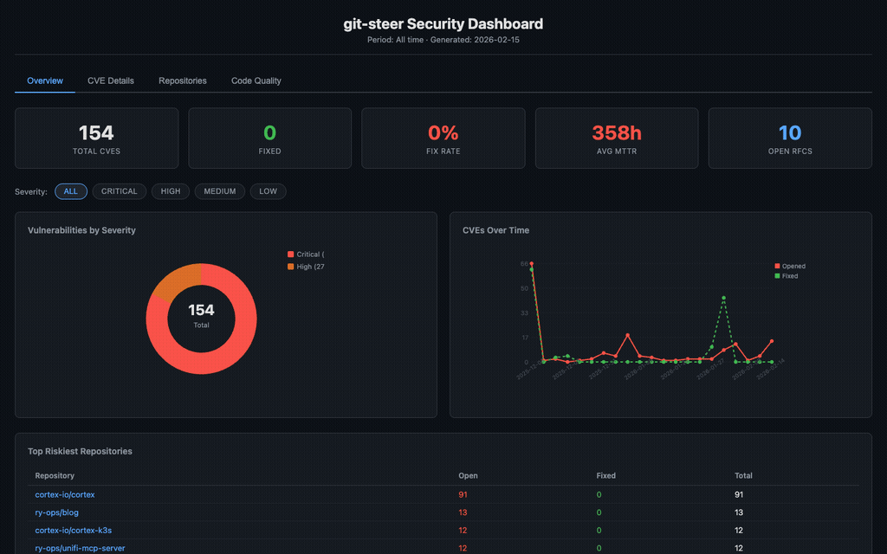
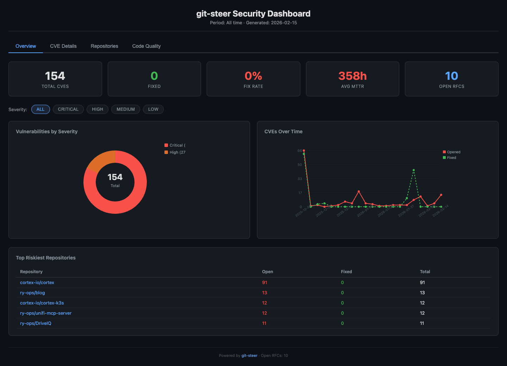
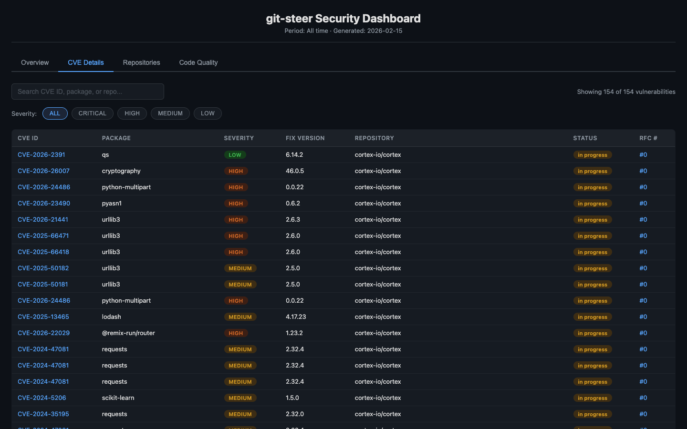
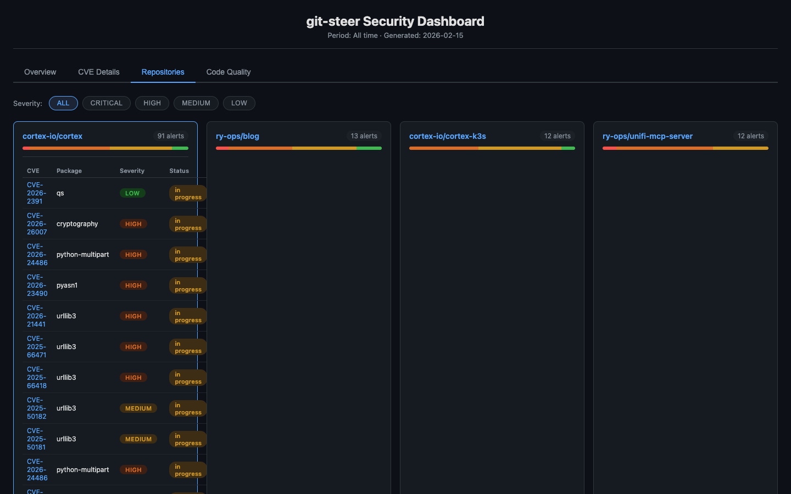
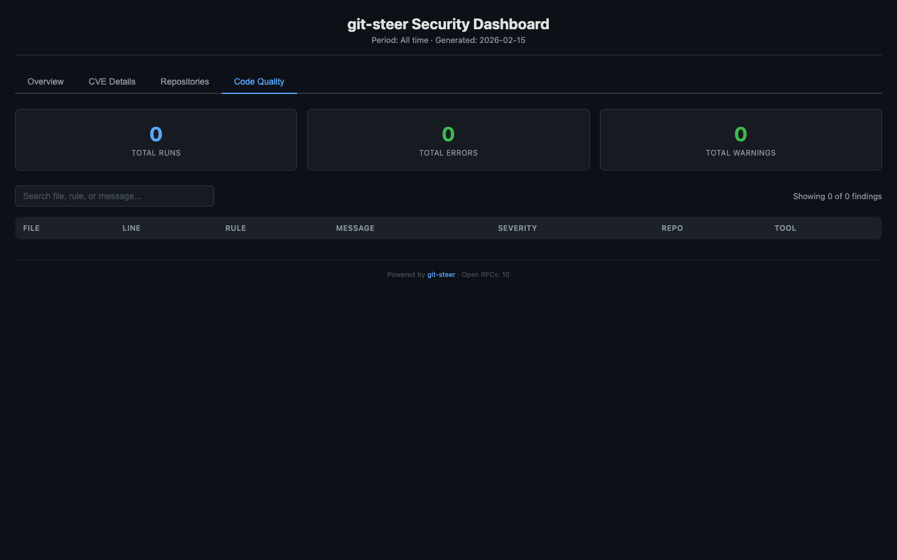

# git-steer



**Self-hosting GitHub autonomy engine.** A skid steer for your repos.

git-steer gives you 100% autonomous control over your GitHub account through a Model Context Protocol (MCP) server. Manage repos, branches, security, Actions — everything — through natural language. Rate-limit-hardened from the ground up: ETag caching, GraphQL batching, concurrency caps, and chunked execution keep it well inside GitHub's API guardrails at any fleet size.

## Philosophy: Zero Footprint

**Your machine steers. GitHub does everything else.**

Nothing lives locally — no cloned repos, no config files, no build artifacts. git-steer treats your PC or Mac as a thin control plane and GitHub as the entire runtime.

- **Zero local code**: No repos cloned, no `node_modules`, no lock files
- **Keychain only**: GitHub App credentials in macOS Keychain — nothing else on disk
- **Git as database**: All config, state, and audit logs live in a private GitHub repo
- **Actions as compute**: Dependency fixes, linting, and PRs happen in ephemeral cloud runners
- **Rate-limit-hardened**: Throttle/retry plugins, ETag caching, GraphQL batching, concurrency caps — safe at any fleet size

```
┌─────────────────────────────────────────────────────────────────┐
│                        YOUR MAC                                 │
│                                                                 │
│   Keychain:                                                     │
│     - GitHub App private key                                    │
│     - App ID / Installation ID                                  │
│                                                                 │
│   $ npx git-steer                  (stdio → Claude Desktop)     │
│   $ npx git-steer --http           (portal → localhost:3333)    │
│         │                                                       │
│         ├─► Pulls itself from ry-ops/git-steer                  │
│         ├─► Pulls state from ry-ops/git-steer-state             │
│         ├─► Runs MCP server in-memory (rate-limit-aware)        │
│         └─► Commits state changes back on shutdown              │
│                                                                 │
└─────────────────────────────────────────────────────────────────┘
                               │
                    Throttled, ETag-cached,
                    GraphQL-batched API calls
                               │
                               ▼
┌─────────────────────────────────────────────────────────────────┐
│                         GITHUB                                  │
│                                                                 │
│   ry-ops/git-steer              (source of truth for code)      │
│   │                                                             │
│   ry-ops/git-steer-state        (private repo)                  │
│   ├── config/                                                   │
│   │   ├── policies.yaml         (branch protection templates)   │
│   │   ├── schedules.yaml        (job definitions)               │
│   │   └── managed-repos.yaml    (what git-steer controls)       │
│   ├── state/                                                    │
│   │   ├── jobs.jsonl            (job history, append-only)      │
│   │   ├── audit.jsonl           (action log + rate telemetry)   │
│   │   ├── rfcs.jsonl            (RFC lifecycle tracking)        │
│   │   ├── quality.jsonl         (linter/SAST results)           │
│   │   └── cache.json            (ETag map + sweep cursor)       │
│   └── .github/workflows/                                        │
│       └── heartbeat.yml         (scheduled triggers)            │
│                                                                 │
└─────────────────────────────────────────────────────────────────┘
```

## How Code Changes Work

When you ask git-steer to fix security vulnerabilities or make other code changes, it **dispatches a GitHub Actions workflow** instead of cloning code locally:

```
┌─────────────────────────────────────────────────────────────────┐
│  YOUR MAC (MCP triggers intent)                                 │
│                                                                 │
│  Claude: "Fix security vulnerabilities in cortex"               │
│       │                                                         │
│       ▼                                                         │
│  git-steer MCP: security_fix_pr(repo: "cortex", ...)            │
│       │                                                         │
│       └─► Dispatches workflow to GitHub Actions                 │
└─────────────────────────────────────────────────────────────────┘
                               │
                               ▼
┌─────────────────────────────────────────────────────────────────┐
│  GITHUB ACTIONS (ephemeral compute)                             │
│                                                                 │
│  .github/workflows/security-fix.yml:                            │
│    - Checkout target repo                                       │
│    - Update dependencies                                        │
│    - npm install / uv lock                                      │
│    - Run tests                                                  │
│    - Create branch, commit, push                                │
│    - Open PR                                                    │
│    - Report status back to git-steer-state                      │
└─────────────────────────────────────────────────────────────────┘
```

Your PC or Mac stays clean. No `node_modules`. No Python venvs. No lock files. Just pure orchestration.

## Quick Start

```bash
# First time setup
npx git-steer init

# This will:
# 1. Create a GitHub App with required permissions
# 2. Install it to your account
# 3. Create a private git-steer-state repo
# 4. Store credentials in macOS Keychain

# Start the MCP server
npx git-steer
```

## Local Footprint

| Item | Location |
|------|----------|
| GitHub App ID | macOS Keychain |
| Installation ID | macOS Keychain |
| Private Key | macOS Keychain |
| Claude config | `~/Library/Application Support/Claude/claude_desktop_config.json` |

That's it. No config files. No dotfiles. No `~/.git-steer`. No cloned repos.

## MCP Tools

### Repository Management
- `repo_list` - List all accessible repositories
- `repo_create` - Create new repo (optionally from template)
- `repo_archive` - Archive a repository
- `repo_delete` - Permanently delete (requires confirmation)
- `repo_settings` - Update repo settings

### Branch Operations
- `branch_list` - List branches with staleness info *(GraphQL-batched)*
- `branch_protect` - Apply protection rules
- `branch_reap` - Delete stale/merged branches *(GraphQL-batched)*

### Security
- `security_scan` - Scan repos for vulnerabilities with fix info
- `security_fix_pr` - **Dispatch workflow** to fix vulnerabilities
- `security_alerts` - List Dependabot/code scanning alerts
- `security_dismiss` - Dismiss alert with reason
- `security_digest` - Summary across all managed repos
- `security_enforce` - Ensure Dependabot alerts + automated fixes are enabled on all managed repos

### Autonomous Security Operations (v0.3.0)
- `security_sweep` - **Full autonomous pipeline**: scan repos, create RFC issues, dispatch fix workflows, track everything — in one call. Supports **chunked execution** for large fleets and **resume** across sessions
- `code_quality_sweep` - Run linters/SAST (ESLint, Ruff, gosec, Bandit) on repos via GitHub Actions
- `report_generate` - Generate compliance reports (executive summary, change records, vulnerability report, full audit)
- `dashboard_generate` - Generate an interactive BI-style security dashboard, deployed to GitHub Pages

### GitHub Actions
- `actions_workflows` - List workflows
- `actions_trigger` - Manually trigger a workflow
- `actions_secrets` - Manage Actions secrets
- `workflow_status` - Check status of dispatched workflows

### File Operations
- `repo_commit` - Commit files directly via GitHub API (no local clone)
- `repo_read_file` - Read a file from a repository *(ETag-cached)*
- `repo_list_files` - List files in a directory

### Code Review
- `code_review` - Run AI-powered code review using CodeRabbit CLI

### Configuration & Observability
- `config_show` - Display current config
- `config_add_repo` - Add repo to managed list (auto-enables Dependabot)
- `config_remove_repo` - Remove from managed list
- `steer_status` - Health check with **full rate limit budget** (all buckets, % remaining, warnings)
- `steer_sync` - Force save state to GitHub
- `steer_logs` - View audit log with rate limit telemetry

## v0.3.0: Rate-Limit Hardened

v0.3.0 is a full API safety overhaul. git-steer now operates conservatively enough to run on large fleets without triggering GitHub's secondary rate limits or abuse detection.

### What Changed

```
┌─────────────────────────────────────────────────────────────────┐
│  API SAFETY STACK (v0.3.0)                                      │
│                                                                 │
│  Layer 1 — Throttle/Retry plugins                               │
│    Primary rate limit (429)   → auto-retry up to 4×             │
│    Secondary rate limit (403) → always back off + retry         │
│    Transient 5xx / network    → exponential backoff             │
│                                                                 │
│  Layer 2 — Concurrency caps (p-limit)                           │
│    Write ops (issues, PRs, blobs)  → max 2 concurrent           │
│    Read ops (scans, fetches, lists) → max 8 concurrent          │
│    Search API                       → max 1 (serial)            │
│                                                                 │
│  Layer 3 — ETag conditional caching                             │
│    Contents API reads send If-None-Match                        │
│    304 Not Modified → cached content, reduced rate cost         │
│    ETag map persisted to cache.json across restarts             │
│                                                                 │
│  Layer 4 — GraphQL batching                                     │
│    Owner resolution  → viewer { login }  (1 call, not N)        │
│    Branch listing    → refs query        (1 call, not N)        │
│    Dependabot alerts → aliased batch     (1 call, not N)        │
│                                                                 │
│  Layer 5 — Rate budget visibility                               │
│    steer_status shows all buckets + % remaining + warnings      │
│    Refreshed at startup and every 30 minutes                    │
│    Warns if any bucket falls below 15%                          │
│                                                                 │
│  Layer 6 — Audit telemetry                                      │
│    Every audit.jsonl entry carries:                             │
│      rate_remaining, rate_reset,                                │
│      is_secondary_limit_hit, retry_count, backoff_ms            │
│                                                                 │
│  Layer 7 — Chunked sweep + cursor                               │
│    security_sweep(chunkSize: 10) → processes 10 repos           │
│    security_sweep(resume: true)  → continues from cursor        │
│    Cursor persisted to cache.json between sessions              │
│    skipRecentHours → skip repos swept within N hours            │
└─────────────────────────────────────────────────────────────────┘
```

### security_sweep: Now Fleet-Safe

```
# Process a large fleet in chunks of 10 — safe on any account size
security_sweep({ severity: "critical", chunkSize: 10 })
→ { hasMore: true, nextIndex: 10, totalRepos: 47, ... }

# Resume from where you left off (cursor persisted to GitHub)
security_sweep({ resume: true })
→ { hasMore: true, nextIndex: 20, totalRepos: 47, ... }

# Skip repos swept in the last 6 hours (polling-fallback)
security_sweep({ skipRecentHours: 6 })
```

### Rate Limit Visibility

```
steer_status()
→ {
    rateLimit: {
      buckets: {
        core:          { remaining: 4823, limit: 5000, percentRemaining: 96 },
        graphql:       { remaining: 4950, limit: 5000, percentRemaining: 99 },
        search:        { remaining: 28,   limit: 30,   percentRemaining: 93 },
        code_scanning: { remaining: 999,  limit: 1000, percentRemaining: 99 }
      },
      warnings: [],        // populated when any bucket < 15%
      hasWarnings: false
    }
  }
```

## v0.2.0: Autonomous Security Operations

v0.2.0 added a fully autonomous security pipeline replacing manual repo-by-repo CVE sweeps with a single tool call.

### Security Sweep Pipeline

```
security_sweep(severity: "high", repos: ["org/app1", "org/app2"])
```

What happens:
1. Scans each repo for Dependabot alerts + CodeQL findings *(GraphQL-batched)*
2. Creates ITIL-formatted RFC issues with CVE tables and risk assessments
3. Dispatches a GitHub Actions workflow that fixes dependencies across all repos in parallel
4. Workflow creates branches, commits fixes, opens PRs linked to RFC issues
5. Heartbeat auto-triggers sweeps when new critical alerts appear

### Code Quality

```
code_quality_sweep(owner: "org", repo: "app", tools: ["auto"])
```

Auto-detects language stack and runs appropriate linters (ESLint, Ruff, Bandit, gosec) via GitHub Actions.

### Reports & Dashboard

```
report_generate(template: "executive-summary")
dashboard_generate()
```

- **Reports**: Executive summaries, change records, vulnerability reports, full audits — as markdown
- **Dashboard**: Interactive BI-style security dashboard deployed to GitHub Pages — [**view it live**](https://ry-ops.github.io/git-steer-state/)

#### Interactive Security Dashboard

<p align="center">
  
</p>

A single `dashboard_generate()` call scans your repos, builds an interactive dashboard, and deploys it to GitHub Pages. Zero dependencies — all data embedded as JSON, rendered client-side with vanilla JS.

<details>
<summary><strong>Overview Tab</strong> — Metric cards, severity donut chart, CVE timeline, top 5 riskiest repos</summary>
<br>

</details>

<details>
<summary><strong>CVE Details Tab</strong> — Full sortable table with live search, NVD links, severity pills, status badges</summary>
<br>

</details>

<details>
<summary><strong>Repositories Tab</strong> — Expandable repo cards with severity breakdown bars and per-repo CVE tables</summary>
<br>

</details>

<details>
<summary><strong>Code Quality Tab</strong> — Sortable findings table with search across linter/SAST results</summary>
<br>

</details>

**Key features:**
- **5 interactive tabs**: Overview, CVE Details, Repositories, Code Quality, About
- **Global severity filter**: Click CRITICAL/HIGH/MEDIUM/LOW to filter across all tabs
- **Sortable tables**: Click any column header to sort asc/desc
- **Live search**: Filter CVE and quality tables by typing
- **Expandable repo cards**: Click to drill into per-repo vulnerability details
- **Hover tooltips**: Hover metric cards to see what each metric means
- **Run Security Scan**: Trigger a workflow dispatch from the dashboard (requires PAT)
- **CSV export**: Download current tab data as CSV (respects active filters)
- **Click-to-copy CVE IDs**: Click any CVE link to copy to clipboard
- **Keyboard shortcuts**: `1`-`5` switch tabs, `Esc` close modals, `?` show hints
- **Fullscreen mode**: Toggle fullscreen from the header
- **NVD links**: Every CVE ID links directly to the NVD detail page

### Daily Automated Pipeline

The full pipeline runs daily via the Heartbeat GitHub Actions workflow:

```
┌─────────────────────────────────────────────────────────────────┐
│  GITHUB ACTIONS (daily at 6 AM UTC)                             │
│                                                                 │
│  Heartbeat workflow:                                            │
│    1. Enforce Dependabot on all managed repos                   │
│    2. Scan all repos for Dependabot alerts                      │
│    3. Auto-trigger security sweep for critical alerts           │
│    4. Follow up on security PRs (merged/stale/conflict)         │
│    5. Regenerate dashboard from fresh data                      │
│    6. Sync changelog entries to blog                            │
│    7. Log heartbeat status (always, even on failure)            │
│                                                                 │
│  No local machine needed. Everything runs in the cloud.         │
└─────────────────────────────────────────────────────────────────┘
```

#### PR Lifecycle Tracking

Security PRs are tracked to completion automatically. The follow-up step:
- **Merged PRs**: marks RFC as fixed, computes MTTR, closes the RFC issue
- **Stale PRs (>48h)**: nudges reviewers with a comment, adds `stale` label
- **Merge conflicts**: flags with a comment and `merge-conflict` label
- **Closed without merge**: resets RFC to open (fix failed, retry needed)
- **Orphan scan**: catches security PRs not linked to any RFC

#### Changelog Pipeline

Merged PRs across all managed repos are automatically turned into changelog entries and committed to the [blog repo](https://ry-ops.dev/changelog/). The pipeline classifies PRs (feature/fix/improvement), generates frontmatter, and deduplicates by filename.

## Example Usage

```
You: "List all my repos"
Claude: [calls repo_list]

You: "Scan all my repos for security vulnerabilities"
Claude: [calls security_scan with repo="*"]

You: "Fix the critical vulnerabilities in cortex"
Claude: [calls security_fix_pr - dispatches workflow to GitHub Actions]

You: "Check the status of the fix"
Claude: [calls workflow_status]

You: "Run a security sweep across all managed repos, 10 at a time"
Claude: [calls security_sweep with chunkSize=10, then resumes until done]

You: "What's my API rate limit headroom?"
Claude: [calls steer_status - shows all buckets with % remaining]

You: "Delete all branches older than 60 days in mcp-unifi, except main"
Claude: [calls branch_reap with daysStale=60, exclude=['main']]

You: "Archive my old-project repo"
Claude: [calls repo_archive]
```

## Claude Desktop Integration

Add to `~/Library/Application Support/Claude/claude_desktop_config.json`:

```json
{
  "mcpServers": {
    "git-steer": {
      "command": "npx",
      "args": ["git-steer"]
    }
  }
}
```

Or use a local checkout:

```json
{
  "mcpServers": {
    "git-steer": {
      "command": "node",
      "args": ["/path/to/git-steer/bin/cli.js", "start", "--stdio"]
    }
  }
}
```

## GitHub App Permissions Required

The git-steer GitHub App needs these permissions:

- **Repository**: Read & Write (contents, metadata)
- **Pull Requests**: Read & Write
- **Issues**: Read & Write (for RFC tracking)
- **Actions**: Read & Write (for workflow dispatch)
- **Dependabot alerts**: Read & Write (for enabling vulnerability alerts)
- **Code scanning alerts**: Read (for CodeQL integration)
- **Secrets**: Read & Write (for Actions secrets)
- **Administration**: Read & Write (for repo settings)
- **Pages**: Read & Write (for dashboard deployment)

## Setting Up Secrets

For the security-fix workflow to authenticate to target repos, add these secrets to the git-steer repo:

1. `GIT_STEER_APP_ID` - Your GitHub App ID
2. `GIT_STEER_PRIVATE_KEY` - Your GitHub App private key

These allow the workflow to generate installation tokens for any repo in your installation.

## Local Portal

git-steer includes an HTTP/SSE transport mode that exposes the MCP server as a local web portal:

```bash
# Start portal on default port 3333
git-steer start --http

# Custom port
git-steer start --http --port 8080
```

```
┌─────────────────────────────────────────────────────────────────┐
│  LOCAL PORTAL  →  http://localhost:3333                         │
│                                                                 │
│  /dashboard   Live security dashboard (rendered from state)     │
│  /mcp         Streamable HTTP MCP endpoint (protocol 2025-11)   │
│  /sse         Legacy SSE MCP endpoint    (protocol 2024-11)     │
│  /messages    Legacy POST endpoint for SSE clients              │
│  /health      JSON status + active session count                │
│                                                                 │
│  Use cases:                                                     │
│    - View the security dashboard without deploying to Pages     │
│    - Connect any MCP-compatible client (not just Claude)        │
│    - Run git-steer headless on a server or NAS                  │
│    - Script against the MCP API directly                        │
└─────────────────────────────────────────────────────────────────┘
```

The portal uses the same Keychain credentials, same state repo, and same rate-limit-hardened API stack as stdio mode. The dashboard at `/dashboard` renders live from in-memory state on every request — no GitHub Pages deployment needed.

## Commands

```bash
git-steer init                       # First-time setup
git-steer                            # Start MCP server via stdio (Claude Desktop)
git-steer start --http               # Start local portal on port 3333
git-steer start --http --port 8080   # Start portal on custom port
git-steer scan                       # Run security scan across all repos
git-steer scan --repo owner/name     # Scan a specific repo
git-steer scan --severity critical   # Filter by severity
git-steer status                     # Show status + rate limit budget
git-steer sync                       # Force sync state to GitHub
git-steer reset                      # Remove local credentials
```

## Release History

| Version | Highlights |
|---------|------------|
| `v0.3.0` | Rate-limit hardening: throttle/retry plugins, p-limit concurrency caps, ETag caching, GraphQL batching, chunked sweep with cursor, full audit telemetry |
| `v0.2.0` | Autonomous security pipeline: sweep → RFC → fix PR → track MTTR. Dashboard, reports, code quality sweep |
| `v0.1.0` | Manual security ops, branch management, repo settings, MCP server core |

```bash
npx git-steer@0.3   # v0.3.x (rate-limit hardened)
npx git-steer@0.2   # v0.2.x (autonomous security ops)
npx git-steer@0.1   # v0.1.x (manual security ops)
npx git-steer       # latest
```

## Offline Behavior

When offline, git-steer runs in read-only mode with cached state. Write operations queue until next online session. ETag cache remains valid across offline periods.

## Security

- All GitHub API access through a dedicated GitHub App (not your personal token)
- Credentials stored in macOS Keychain (syncs via iCloud Keychain if enabled)
- Full audit log of all actions with rate limit telemetry in state repo
- No secrets in code or config files
- No code stored locally — everything ephemeral
- SSH commit signing enforced on main branch

## License

MIT

---

Built by [ry-ops](https://github.com/ry-ops)
