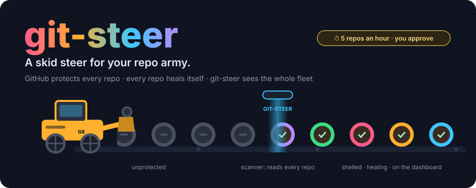
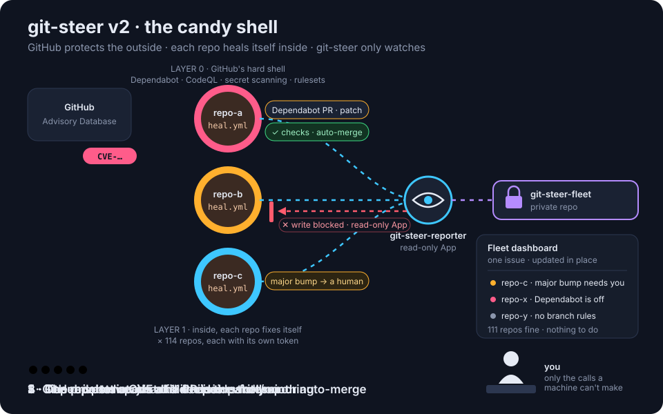
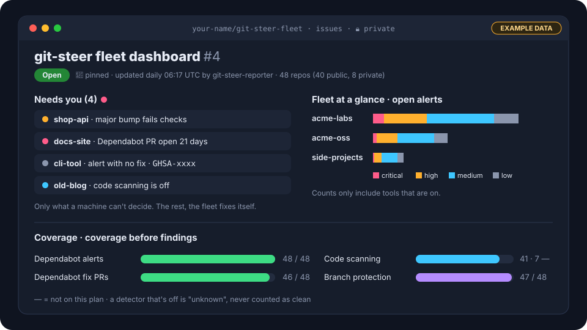
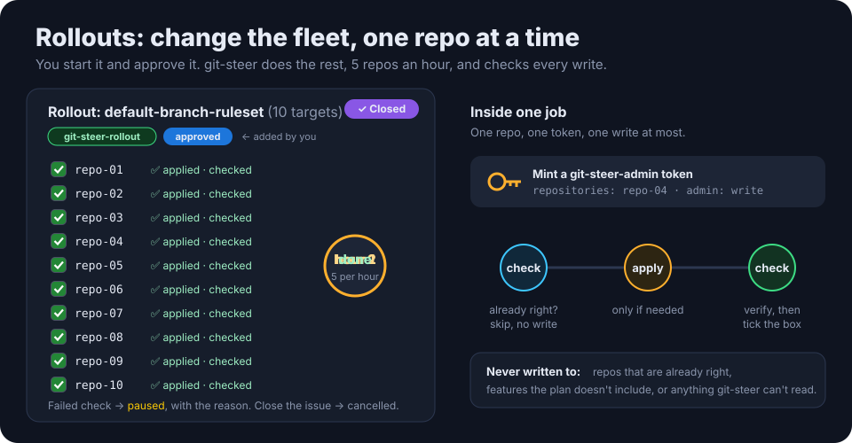
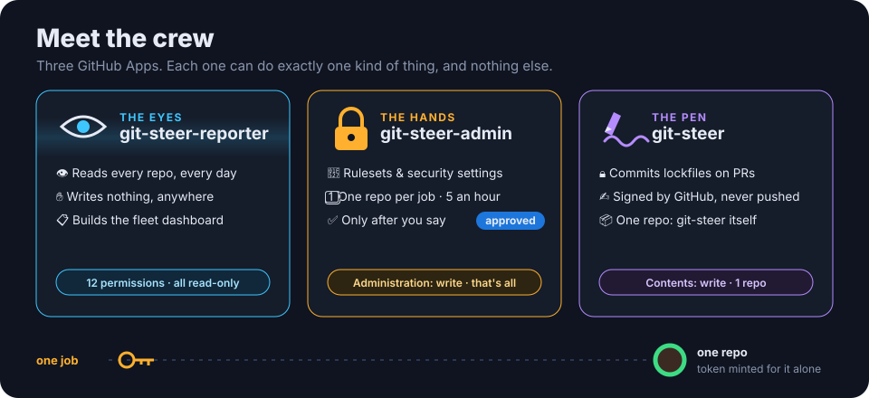

<p align="center">
  
</p>

<p align="center">
  <a href="https://github.com/ry-ops/git-steer/actions/workflows/ci.yml"></a>
  
  
  
  <a href="LICENSE"></a>
</p>

<p align="center">
  <b>Fleet health for every repo you own, public and private, run entirely on GitHub.</b><br>
  No servers. No laptop daemons. No personal tokens. Just GitHub Apps, Actions, and one dashboard issue.
</p>

<p align="center">
  <a href="#how-it-works">How it works</a> ·
  <a href="#dashboard">The dashboard</a> ·
  <a href="#rollouts">Rollouts</a> ·
  <a href="#crew">The crew</a> ·
  <a href="#run-your-own">Run your own</a> ·
  <a href="#why">Why</a>
</p>

---

<a id="how-it-works"></a>

## 🍬 The candy shell

<p align="center">
  
</p>

Every repo gets a hard outer shell, a soft centre that looks after itself, and one pair of eyes on the whole bag:

| Layer | Who does the work | What it does |
|---|---|---|
| **0 · The shell** | GitHub | Dependabot alerts **and fix PRs**, CodeQL, secret scanning with push protection, branch rules. Turned on per org with code security configurations, and per repo with rulesets. |
| **1 · The centre** | Each repo, on its own token | Merges green patch/minor Dependabot PRs, keeps lockfiles, SBOM and VEX current, and only ever touches itself. *(`heal.yml` is next on the build list.)* |
| **2 · The eyes** | git-steer | Reads every repo and writes one private dashboard. It changes things only through **rollouts** you start and approve. |

<a id="dashboard"></a>

## 👀 See the whole fleet

<p align="center">
  
</p>

Every morning git-steer reads **every repo it's installed on** and updates **one pinned issue** in your private fleet repo:

- **Needs you:** only what a machine can't decide. Alerts with no fix, Dependabot PRs stuck for more than 14 days, dismissals with no reason, settings that are off, and missing branch protection.
- **Coverage before findings.** If a detector is off, that repo's findings show as **unknown**, never as zero. A quiet repo has to *prove* it's quiet.
- **Plan limits aren't failures.** When GitHub says a feature needs a paid plan, the dashboard says **"not on this plan"**, not "off".
- **Private by design.** Fleet data lives only in a private repo. This public repo never holds a repo name, an alert or a number from your fleet.
- **`status.json`** comes with every run (schema `git-steer/fleet-status@1`), for whatever view you want to build next.

<a id="rollouts"></a>

## 🛠️ Change the fleet, one repo at a time

<p align="center">
  
</p>

When the dashboard shows a gap (say, 90 repos with no branch protection), you don't fix it by hand, and git-steer doesn't fix it behind your back. You start a **rollout**:

1. **Start:** run **Actions → Start rollout** in your fleet repo with a change and a target list, or a selector straight off the dashboard such as `coverage:branchProtection=off`.
2. **Approve:** git-steer opens an issue with one checkbox per repo. **Nothing happens until you add the `approved` label.**
3. **Watch:** every hour, git-steer works through **at most 5 repos**, one job each:
   - it mints a token for **that one repo**;
   - it **checks**, **applies only if needed**, then **checks again**;
   - it ticks the box with before → after and a run link.
4. **Stay in charge:** a failed check **pauses** the rollout with the reason. Removing `paused` resumes it, and closing the issue cancels it.

The first change type is the **default-branch ruleset**: pull request required, signed commits, linear history, no force-push or deletion. Repo admins can always bypass it, so your own day-to-day pushing still works.

<a id="crew"></a>

## 🤝 Meet the crew

<p align="center">
  
</p>

| App | Permissions | Where its key lives | Used by |
|---|---|---|---|
| **git-steer-reporter** · the eyes | 12 permissions, **all read-only** | repo secret in your private fleet repo | the daily fleet report |
| **git-steer-admin** · the hands | **Administration: write** (repo + org) and Metadata. Nothing else. | an environment that **only `main` can deploy** | rollout jobs, one target each |
| **git-steer** · the pen | **Contents: write** on one repo | this repo | `lockfiles.yml`, commits signed by GitHub |

No App can do another's job, and every token is minted per job for one target.

## 🧭 Ground rules

These come straight from the ADRs, and the code holds itself to them:

- **Runs only on GitHub.** Never on a workstation, never with a personal token ([ADR-008](adr/ADR-008.yaml)).
- **No fan-out writes.** One repo or org per job, at most 5 an hour, never in parallel, and always started by a person ([ADR-008](adr/ADR-008.yaml), [ADR-010](adr/ADR-010.yaml)).
- **Fleet data stays private.** The report refuses to run anywhere but a private repo ([ADR-009](adr/ADR-009.yaml)).
- **Coverage before findings.** No false all-clears ([ADR-009](adr/ADR-009.yaml)).
- **Check, apply, check.** Repos that are already right are never written to, and a bad write pauses everything ([ADR-010](adr/ADR-010.yaml)).
- **Everything through pull requests and signed commits.**

<a id="run-your-own"></a>

## 🚀 Run your own

git-steer is built to be forked. Your fork holds the code; a **private** repo of your own runs it and keeps your fleet's data.

1. **Fork** this repo.
2. **Create a private repo**, for example `your-name/git-steer-fleet`:
   - copy [`templates/fleet/.github/`](templates/fleet/.github/workflows) into it;
   - set the repository variable `GIT_STEER_REPO` to your fork.
3. **Create the reporter App** from [`templates/apps/git-steer-reporter.json`](templates/apps/git-steer-reporter.json). That file is a [GitHub App manifest](https://docs.github.com/apps/sharing-github-apps/registering-a-github-app-from-a-manifest), or you can set the same read-only permissions by hand. Then add `REPORTER_APP_ID` and `REPORTER_PRIVATE_KEY` as **repo secrets** in your fleet repo.
4. **Create the admin App** from [`templates/apps/git-steer-admin.json`](templates/apps/git-steer-admin.json). In your fleet repo:
   - create an environment called **`fleet-write`** whose deployment branches are **`main` only**;
   - put `ADMIN_APP_ID` and `ADMIN_PRIVATE_KEY` in **that environment**, not in the repo secrets.
5. **Install both Apps** on every account and org you want covered, with *All repositories*.
6. **Run "Fleet report".** Your pinned dashboard appears. When you're ready, run **"Start rollout"**.

## 🗺️ What's next

- [x] Read-only fleet report and dashboard
- [x] Rollouts with a narrow admin App (default-branch ruleset)
- [ ] More change types: security settings, and the org code security configurations
- [ ] `heal.yml` for Layer 1: auto-merge for green Dependabot patch/minor PRs, lockfiles, SBOM, VEX
- [ ] Per-repo `.github/git-steer.yml`: required checks, auto-merge policy, owner and tier

<a id="why"></a>

## 📜 Why it's built this way

git-steer used to be a central control plane: one identity that opened, gated and merged fixes in every repo. It was shelved on 2026-06-27 because it **didn't fix things**: 21 of 25 gate verdicts were NO-GO, and the bulk PRs never merged. **Its writes did damage** too: a deleted lockfile, a pin onto a vulnerable version, a broken build, and a gate whose output a repo's build log could spoof. Worst of all, **fleet-wide writes from one identity locked the owner's GitHub account.**

So responsibility moved: **down** to GitHub and to each repo's own CI, which actually know how to protect and test that repo, and **up** to a git-steer that watches everything, writes almost nothing, and asks before it does. The full reasoning is in [ADR-008](adr/ADR-008.yaml), [ADR-009](adr/ADR-009.yaml) and [ADR-010](adr/ADR-010.yaml). ADR-001 to ADR-007 are kept in [`adr/`](adr/) for the record.

## 🧱 Repository layout

```
adr/                 Architecture decisions (ADR-008 → ADR-010 are current)
src/fleet/           Fleet report: collect (read-only), classify, render the dashboard
src/rollout/         Rollouts: change types (check + apply), issue format, hourly plan
src/github/          Rate-limit-hardened GitHub client
scripts/             Runners called by the fleet repo's workflows
templates/fleet/     Workflows for your private fleet repo
templates/apps/      App manifests for the reporter and admin Apps
docs/                The animations on this page
.github/workflows/   CI and lockfiles for this repo
```

## 🧪 Development

```bash
npm ci
npm run build          # tsc
npm run lint           # eslint src/
npm test -- --run      # vitest
```

CI runs all three on every pull request (Node 24). Don't edit lockfiles by hand: change `package.json` in a PR and the **Lockfiles** workflow commits the matching `package-lock.json`, signed by GitHub.

## License

MIT

<!-- org-footer -->
---

<p align="center"><sub>Part of <a href="https://github.com/ry-ops">ry-ops</a> · building the pipes between infrastructure, automation, and observability · built by <a href="https://github.com/ry-ops">ry-ops</a></sub></p>
