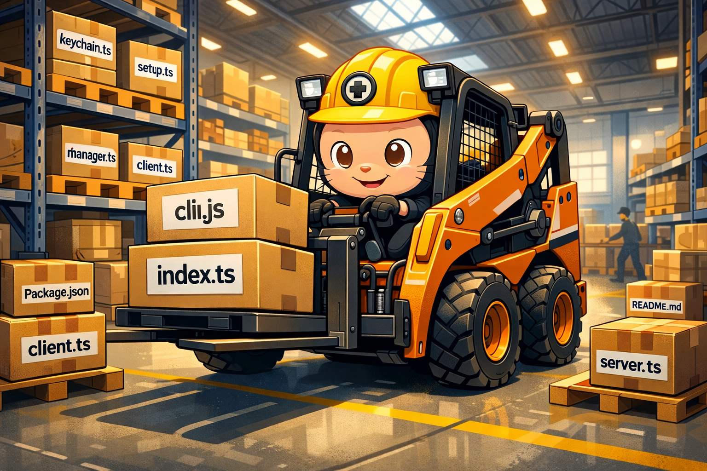

# git-steer



**GitHub fleet health, run entirely on GitHub.** A skid steer for your repos.

git-steer looks after a fleet of about 113 repositories across ry-ops, git-fabric, cortex-io, fabric-forge, TAEM-DEV and m5stack-lab. Since [ADR-008](adr/ADR-008.yaml) it does this by letting GitHub protect each repo, letting each repo fix itself, and keeping the fleet-wide view read-only.

> **Status: in transition.** The central auto-remediation that git-steer used to run (ADR-002 to ADR-007) was shelved on 2026-06-27 and is being removed. Read [Why it changed](#why-it-changed) for the reasons, and [What's being retired](#whats-being-retired) for what is left to remove.

## How it works

```
 LAYER 2  git-steer (fleet)        reads only ──► one self-closing summary issue
          ─────────────────────────────────────────────────────────────────────
 LAYER 1  each repo heals itself   heal.yml@v1 caller, repo-scoped token only
          ─────────────────────────────────────────────────────────────────────
 LAYER 0  GitHub-native            Dependabot · CodeQL · push protection · rulesets
```

### Layer 0: GitHub protects every repo
Settings are applied once per organization, through org security configurations and org rulesets:

- **Dependabot alerts and Dependabot security updates on.** Dependabot is the first-line fixer.
- **CodeQL** default setup.
- **Secret scanning** with push protection.
- **Rulesets** on default branches: pull request required, required status checks, signed commits, linear history, enforced for admins, with an owner-only bypass.

### Layer 1: each repo heals itself
Each repo opts in with a short caller of a reusable workflow published here, `heal.yml@v1` (coming next). It runs on Dependabot pull requests and on a daily schedule staggered by repo name. It only ever acts on the repo it runs in:

- **Auto-merge.** It enables GitHub's native auto-merge on green Dependabot **patch and minor** PRs, so the repo's own required checks decide. Majors are left to a human.
- **Lockfiles.** It regenerates lockfiles when a PR changes a manifest.
- **SBOM.** It keeps the repo's SBOM current.
- **VEX.** It records dismissed Dependabot alerts as VEX statements.

**Tokens.** heal.yml uses the repo's own `GITHUB_TOKEN`, which can read Dependabot alerts with `permissions: vulnerability-alerts: read` (checked on a real runner). The git-steer App token is used only where `GITHUB_TOKEN` can't do the job, and is always scoped to that single repository.

**Working prototype.** This repo's [`lockfiles.yml`](.github/workflows/lockfiles.yml) regenerates `package-lock.json` on PRs and commits it through the GitHub API, so the commit is signed by GitHub.

### Layer 2: git-steer reads and reports
The fleet view uses read APIs only and writes nothing to managed repos. Its single output is one summary issue in `ry-ops/git-steer-state`, listing only decisions a machine can't make:

- a major update that fails checks;
- an alert with no patched version;
- a Dependabot PR that has stayed open too long;
- a repo missing required checks.

When the list is empty, the issue closes itself.

## Ground rules

These are hard constraints from ADR-008:

- **Runs only on GitHub.** git-steer is never installed, run or kept on a workstation.
- **No personal credentials.** Automation uses a repo's `GITHUB_TOKEN`, or a git-steer App token minted for one repository.
- **No fan-out writes.** No run writes to more than one repo. Anything that must touch many repos is done one reviewed PR at a time, at most 5 repos per hour, and is started by a person.
- **Everything through pull requests.** Default branches require signed commits and linear history.

## Why it changed

The central control plane opened, gated and merged dependency fixes in every managed repo from one place. It was shelved because:

- **It didn't fix things.** 21 of 25 gate verdicts were NO-GO, and the bulk "patch 30 vulnerabilities" PRs never merged.
- **Its writes caused damage.** Examples found while repairing this repo:
  - it deleted the root `package-lock.json`;
  - it pinned `react-router` to a vulnerable version;
  - an esbuild override it added broke the web build;
  - its gate's output could be spoofed by a repo's own build log.
- **It was the biggest risk on the account.** Fleet-wide automated writes from one identity set off GitHub security alerts that locked the owner's account.

The full reasoning is in [ADR-008](adr/ADR-008.yaml), which supersedes [ADR-007](adr/ADR-007.yaml).

## What's being retired

Each item below is removed in its own PR (ADR-008, C-008-009). The scheduled and event-driven workflows are already disabled.

| Item | What it did |
|---|---|
| ~~`cve-scan.yml`~~ | Ran `npm audit fix` and force-pushed. **Removed.** |
| ~~`heartbeat.yml`, `event-remediate.yml`~~ | Fleet sweep and event triggers for central remediation. **Removed**, with the scripts only they called (`escalate-remediate`, `ci-pr-followup`, `ci-compact`). `ci-dashboard.mjs` is kept for Layer 2. |
| ~~`security-fix-worker.yml`, `verify-functional-form.yml`, `scripts/gate/`~~ | Central fix, gate and merge pipeline. **Removed**, with `src/core/verdict.ts` and `scripts/dispatch-fixes.mjs`. |
| ~~`lock-regen.yml`~~ | Regenerated lockfiles in other repos (the run in 0758a5d deleted this repo's root lockfile). **Removed.** Lockfiles are now regenerated by each repo's own PR workflow; see `lockfiles.yml`. |
| ~~`code-quality.yml`~~ | Ran linters in other repos and opened issues there. **Removed**, with the `code_quality_sweep` MCP tool that dispatched it. |
| ~~`/api/cve/fix`, `/api/cve/fix-all`, `fabric_cve_triage`~~ | Opened PRs and merged them seconds later. **Removed**: the routes, the web UI's Fix / Fix All buttons, and the client methods that opened and merged PRs. (`fabric_cve_triage` was already unrouted under ADR-007; its last web route is gone.) |
| ~~The MCP server, local CLI and Keychain setup~~ (`src/mcp`, `bin/cli.js`, `git-steer init`, `npx git-steer`, the `git-steer/fabric` app) | Ran git-steer on a workstation, with ~60 tools including repo create/delete/commit/settings, branch protect/reap and PR create/merge. **Removed entirely**, with the root `Dockerfile`, the local-install docs and the manual fleet scripts in `scripts/` (several fanned out writes and read the App key from Keychain). |
| `deploy-web.yml`, `Dockerfile.web`, `src/web`, `web/` | Deployed the web dashboard to a self-hosted k3s cluster, which isn't GitHub (C-008-001) |

What stays as Layer 2 building blocks: the rate-limit-hardened GitHub client (`src/github/client.ts`: throttle and retry, ETag caching, GraphQL batching, concurrency caps), the state manager, and `scripts/ci-dashboard.mjs` with `src/dashboard/`.

## Repository layout

```
adr/                     Architecture decisions (ADR-008 is current)
src/                     TypeScript: GitHub client, state manager, dashboard templates, web API (src/web, being retired)
web/                     React dashboard (being retired with the k3s deploy)
scripts/                 ci-dashboard.mjs (Layer 2 building block), ci-changelog.mjs
.github/workflows/
  ci.yml                 Build, lint and test the root package and web/ on every PR
  lockfiles.yml          Regenerate lockfiles on PRs; GitHub-signed commits
  deploy-web.yml         Build and deploy the web dashboard to k3s (being retired)
  changelog.yml          Daily changelog sync to the blog repo (one repo written per run; under review against ADR-008)
  …                      Legacy workflows listed above (disabled)
```

## Development

All checks run in CI on every pull request (`.github/workflows/ci.yml`, Node 24):

```bash
npm ci
npm run build          # tsc
npm run lint           # eslint src/
npm test -- --run      # vitest: 45 tests across 8 files

cd web && npm ci && npm run build   # tsc -b && vite build
```

Don't edit lockfiles by hand. Change `package.json` in a PR and the **Lockfiles** workflow commits the matching `package-lock.json` to the branch. To force a fresh resolution, delete the lockfile in the PR.

## History

- ADR-001 to ADR-007 describe the earlier designs: a zero-footprint MCP server, steered from a workstation, that ran an autonomous remediation loop. They are kept in [`adr/`](adr/) for the record.
- git-steer passed the [TAEM Phase 04 gate review](https://github.com/TAEM-DEV/missions/blob/main/git-steer.md) under that earlier design.

## License

MIT

---

Built by [ry-ops](https://github.com/ry-ops)

<!-- org-footer -->
---

<p align="center"><sub>Part of <a href="https://github.com/ry-ops">ry-ops</a> · building the pipes between infrastructure, automation, and observability · built by <a href="https://github.com/ry-ops">ry-ops</a></sub></p>
